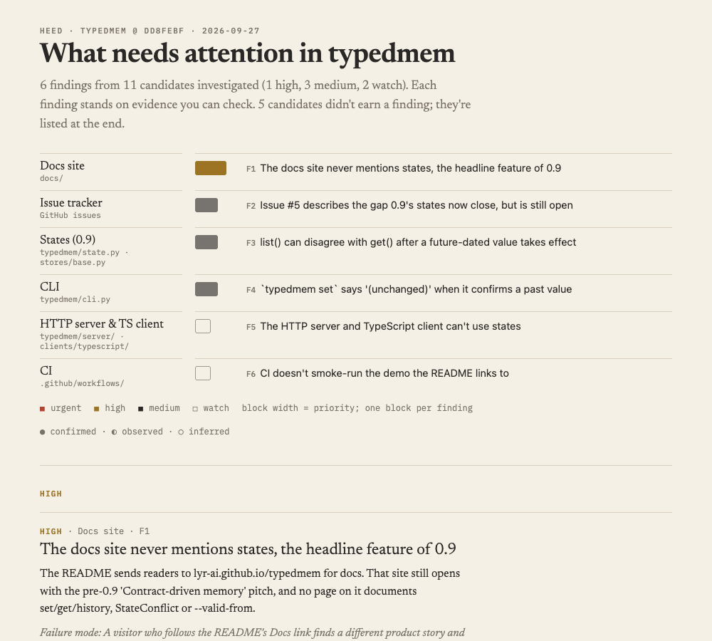

# Heed

**What in this repo deserves attention, and the evidence for it.**

Heed is a skill for the coding agent you already use. Run `/heed` in a
repository and the agent follows a fixed investigation protocol:

1. A deterministic inventory of the repo.
2. Specific, checkable candidate concerns.
3. An investigation of each candidate for evidence.
4. A ranking that is gated by that evidence.

It writes a short list of findings and a self-contained visual report.

[](docs/example-typedmem.png)

*The report from running Heed on [typedmem](https://github.com/lyr-ai/typedmem).*

## Why a protocol, not a prompt

"Analyze this repo and find problems" produces a list of plausible,
uncheckable advice: an **LLM code horoscope**. Heed makes the agent earn
every finding.

- **Inventory first.** A script collects facts with no judgement: structure,
  git churn, TODO/FIXME with their age, tests, CI runs, open issues.
- **Candidates are hypotheses.** For example, "`retry()` may retry POSTs:
  FIXME at `client.py:88`, 9 changes in 90 days, no test for `net/`". Not
  "error handling could be improved".
- **Every evidence item is labelled by certainty.**

  | | Level | Meaning |
  |---|---|---|
  | ● | **confirmed** | The problem is demonstrated: a failing test or command, an open issue reporting it, or docs stating it |
  | ◐ | **observed** | A checkable fact that supports it, with a locator (`file:line`, commit, issue, command output) |
  | ○ | **inferred** | The agent's reasoning, shown as reasoning |

- **Priority is gated by evidence.** `urgent` needs a confirmed item. `high`
  needs a confirmed item, or observed evidence of two different kinds, plus a
  failure mode. A concern with only inferred evidence is not a finding. The
  validator enforces these gates and checks that every file, line and commit
  it cites actually exists.
- **Ranking is explained, not scored.** Each finding states its impact and
  why it matters now.
- **What was set aside is shown.** Candidates that didn't earn a finding are
  listed with the reason.

## Install

Heed is a directory of instructions and three small Python scripts (3.10+,
standard library only). It needs no API key and no service: the agent you
already run does the reading and reasoning.

```bash
git clone https://github.com/lyr-ai/heed ~/src/heed
ln -s ~/src/heed/skills/heed ~/.claude/skills/heed      # Claude Code
```

For other agents that support skills or custom instructions, point them at
`skills/heed/SKILL.md`.

## Use

In any git repository:

| Command | What it does | Writes |
|---|---|---|
| `/heed` or `/heed health` | Investigates what in the code deserves attention | `.heed/findings.json` |
| `/heed goal` | Drafts what the project is trying to be (goal, users, capabilities with status, boundary) from the project's own docs, flags where those docs disagree, and asks you to confirm | `.heed/project.json` |
| `/heed plan` | Combines the confirmed goal, the health findings and (optionally) [Beacon](https://github.com/lyr-ai/beacon)'s market evidence into a **gap map** (promises × surfaces) and a **roadmap**: now (≤3, each with why-now) / next (≤5) / later / **not now**, where scope creep is refused out loud. Every item cites its reasons; open questions become owner decisions | `.heed/plan.json` |

Every mode also writes `.heed/inventory.json` (the deterministic facts it
started from) and re-renders `.heed/report.html`. That is one file with no
server: the confirmed project first, then an attention map, then findings by
priority, with evidence on demand. Add `.heed/` to `.gitignore`.

Formats: [findings and project](skills/heed/format.md).

Heed is **read-only**. It writes nothing outside `.heed/`, and runs the
project's tests only if they're documented, fast and offline.

On a work repository, check that your company allows the coding agent you
use to read that code. Heed adds no service of its own.

## Status and roadmap

Heed is used by its author on their own repos. Each step is dogfooded on
real projects before the next one starts.

- **v0.1 health.** Done.
- **v0.2 goal.** Done. The goal is confirmed by the owner, never decided by
  the agent.
- **v0.3 plan.** Done. A gap map and a now / next / later / not-now roadmap,
  where every item resolves to a finding, a gap cell, the confirmed goal, a
  Beacon pain or an owner decision. The validator refuses unevidenced
  opportunities, out-of-scope work outside *not now*, more than 3 *now*
  items, and pending decisions cited as reasons.
- **Later: history.** What changed since the previous plan, and why.

Market and user research (who has the problem, where they are, what they
ask for) belongs to the companion skill
[Beacon](https://github.com/lyr-ai/beacon). Heed will read Beacon's
signals rather than scraping the web itself.

Issues about a finding Heed got wrong, or one it missed, are the most useful
kind.

## Also from lyr-ai

[TypedMem](https://github.com/lyr-ai/typedmem) (memory for AI agents when
facts change) · [AgentSeism](https://github.com/lyr-ai/agentseism)
(regression decisions for stochastic AI systems).

MIT licensed.
